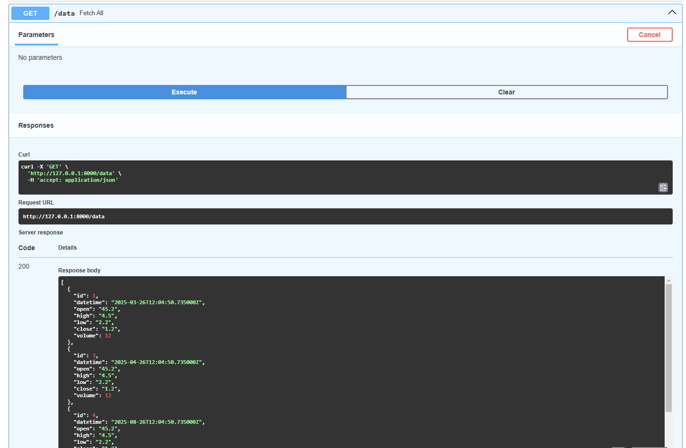
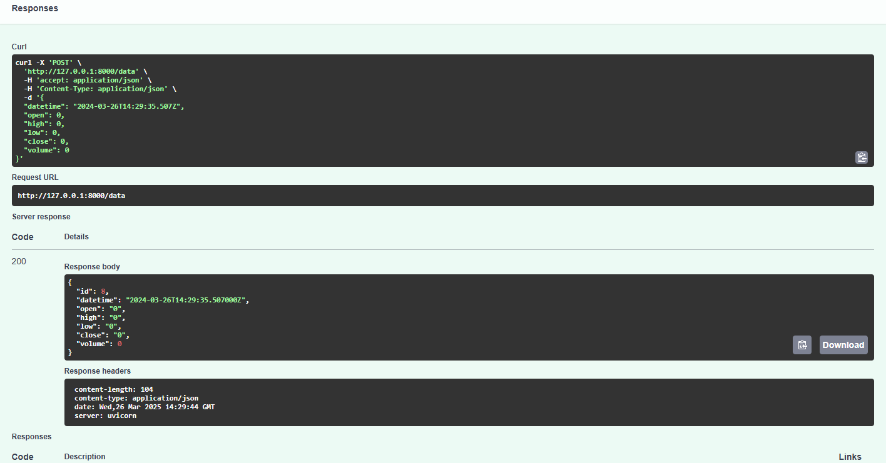
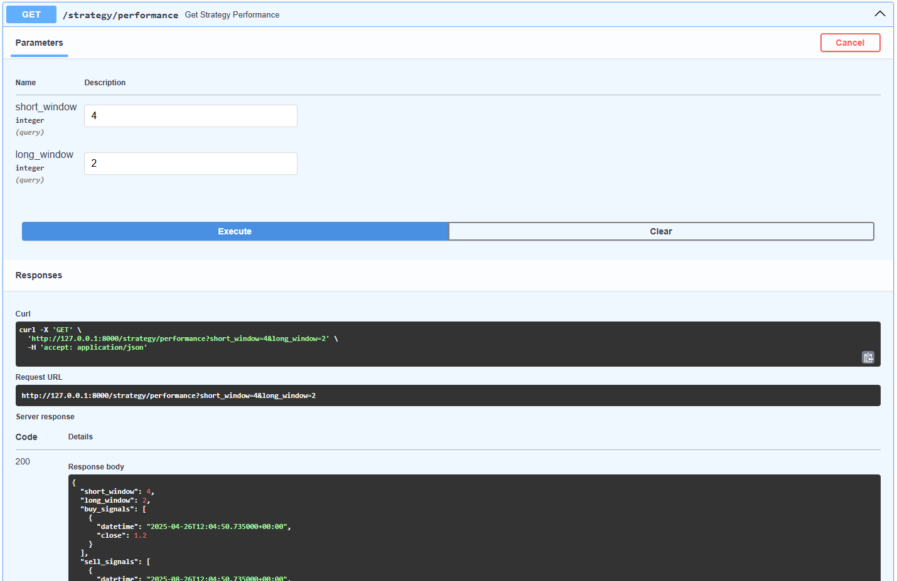
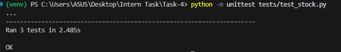

# Ayushiiitu Invsto Assignment

This project is a stock analysis tool that includes APIs for stock-related data, strategy implementation, and moving average calculations. It uses Prisma for database management and Docker for containerization.

## Installation

### Prerequisites
- Python 3.8+
- Docker & Docker Compose
- Prisma CLI (if making schema changes)

### Steps to Run Locally

1. Clone the repository:
   ```bash
   git clone https://github.com/AyushIIITU/Invsto-Assignment.git .
   ```

2. Create a virtual environment and activate it:
   ```bash
   python -m venv venv
   source venv/bin/activate  # On Windows use `venv\Scripts\activate`
   ```

3. Install dependencies:
   ```bash
   pip install -r requirements.txt
   ```

4. Start the database and services using Docker Compose:
   ```bash
   docker-compose up -d
   ```

5. Apply Prisma migrations:
   ```bash
   prisma migrate deploy
   ```

6. Run the main application:
   ```bash
   fastapi run main.py
   ```
7. Run the unit test application:
   ```base
   python -m unittest tests/test_stock.py
   ```

2. Example test data:
   - Located in `tests/test_stock.csv`

## API Endpoints

### Stock API
- **GET /data** - Fetch all stock data
- **POST /data** - Add new stock data
- **GET /strategy/performance** - Get strategy performance

## Screenshots
-API Endpoints Screenshots



-Test Result Screenshots

